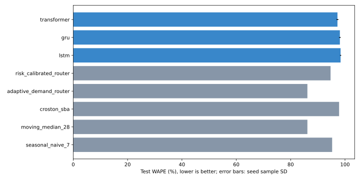
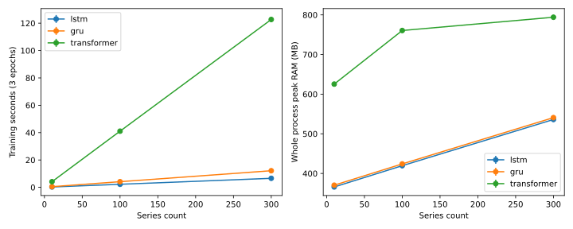

# Основное исследование по ИУП

Результаты сформированы из фактически завершённых запусков. Протокол зафиксирован до итогового test.

100 товаров, 739 дней, train до 16.09.2011, validation до 11.11.2011, test 12.11–09.12.2011.
Нулевые дневные продажи: 73.58%. Это преимущественно редкий нерегулярный спрос. [Профиль набора](data-profile.json) описывает полный период после завершения эксперимента и не используется для выбора SKU или параметров.
24 validation-конфигурации, максимум 20 эпох, patience 4; seeds итоговой оценки 42, 43, 44.
Среднее ± выборочное стандартное отклонение описывает разброс seeds на одном test, не доверительный интервал переноса на другой склад.

## Точность и производительность

| Модель | WAPE % | Bias % | Coverage % | Обучение, с | Inference, мс | RAM, MB | Параметры |
|---|---:|---:|---:|---:|---:|---:|---:|
| seasonal_naive_7 | 95.27 | -4.53 | — | — | — | — | 0 |
| moving_median_28 | 86.17 | -57.22 | — | — | — | — | 0 |
| croston_sba | 97.83 | -2.31 | — | — | — | — | 0 |
| adaptive_demand_router | 86.17 | -57.22 | — | — | — | — | 0 |
| risk_calibrated_router | 94.69 | -24.86 | — | — | — | — | 0 |
| lstm | 98.38 ± 0.23 | -92.41 ± 0.39 | 19.18 ± 0.11 | 14.05 ± 0.20 | 2.32 ± 0.46 | 419.30 ± 0.19 | 8916 |
| gru | 98.12 ± 0.29 | -92.30 ± 0.92 | 19.24 ± 0.15 | 26.69 ± 0.16 | 5.28 ± 0.09 | 424.44 ± 0.22 | 7380 |
| transformer | 97.23 ± 0.37 | -92.37 ± 0.86 | 25.21 ± 0.13 | 150.49 ± 2.96 | 12.66 ± 0.48 | 517.57 ± 0.37 | 22260 |

Baseline оценивается при общей истории 90 дней; архитектурная история выбирается по validation. Полные MAE, RMSE, risk cost и сегменты: [summary.json](summary.json).
Все прогнозы итоговых девяти checkpoint экспортированы в `forecasts/`; совпадение WAPE с зафиксированными результатами проверено. Это повторный inference сохранённых весов для экспорта, без нового обучения или подбора. Дополнительные сегментные таблицы используют общую историю 90 дней для классификации всех архитектур.
Покрытие нужно сопоставлять с номинальными 80%. Положительный q10 исключает нулевые продажи из интервала, поэтому для редкого спроса эта параметризация может быть непригодна. Низкое покрытие означает, что интервалы нельзя применять как откалиброванный уровень сервиса; это выявленное ограничение прототипов, требующее отдельного будущего исследования.



## Гибкость: контролируемые сценарии

Синтетические данные, 12 товаров × 540 дней, три seeds обучения. Будущие акции/цены не передаются модели; причинный эффект акции не оценивается.

| Сценарий | LSTM WAPE % | GRU WAPE % | Transformer WAPE % | Лучший baseline | WAPE % |
|---|---:|---:|---:|---|---:|
| seasonality | 40.91 ± 1.26 | 39.93 ± 2.11 | 41.82 ± 1.33 | seasonal_naive_7 | 30.65 |
| trend | 19.70 ± 2.33 | 19.88 ± 1.07 | 22.75 ± 0.24 | moving_median_28 | 15.05 |
| promotion | 32.20 ± 0.77 | 33.37 ± 0.27 | 31.72 ± 1.38 | moving_median_28 | 30.95 |
| external_factors | 20.96 ± 1.04 | 20.35 ± 0.41 | 21.34 ± 0.19 | moving_median_28 | 21.85 |

## Масштабируемость

Фиксированные три эпохи, два seeds, свежий процесс на каждый замер, два CPU-потока. RAM включает интерпретатор, библиотеки и данные. Это измерение ресурсов, а не оценка точности после полного обучения.

| Ряды | Модель | Обучение, с | RAM, MB |
|---:|---|---:|---:|
| 10 | lstm | 0.27 ± 0.02 | 365.88 ± 0.16 |
| 10 | gru | 0.51 ± 0.01 | 370.33 ± 0.06 |
| 10 | transformer | 4.15 ± 0.00 | 625.38 ± 0.08 |
| 100 | lstm | 2.26 ± 0.07 | 419.55 ± 0.32 |
| 100 | gru | 4.15 ± 0.02 | 424.06 ± 0.14 |
| 100 | transformer | 41.07 ± 0.02 | 760.62 ± 0.13 |
| 300 | lstm | 6.62 ± 0.16 | 536.11 ± 0.12 |
| 300 | gru | 12.16 ± 0.25 | 540.83 ± 0.44 |
| 300 | transformer | 122.70 ± 1.75 | 794.14 ± 0.34 |



## Выбор модели

На данном test минимальный WAPE у **moving_median_28** (86.17%). Это результат сравнения на одной выборке, а не гарантия для нового склада.
Выбирать рабочую модель нужно по будущему validation конкретного склада, учитывать Bias, тип спроса, стоимость дефицита и вычислительные ограничения. Превосходство нейросети над baseline не является обязательным условием корректного исследования.

Сегменты спроса и разброс seeds следует смотреть вместе с общей метрикой. При плохом покрытии интервала закупочные решения по q90 требуют отдельной калибровки и проверки уровня сервиса.

Прототипы прогнозируют медиану q50, что при большом числе нулей может приводить к сильному недопрогнозу суммарного объёма. Для закупочной задачи с асимметричной стоимостью нужен отдельно выбранный и проверенный уровень прогноза. Победа по симметричной WAPE не доказывает оптимальность для закупок.

Рекомендации, непосредственно следующие из измерений:

- Среди нейросетей минимальный средний test WAPE у transformer (97.23 ± 0.37%). Это кандидат для дальнейшей проверки точности, а не основание заменить лучший baseline.
- При ограничении CPU-бюджета первым кандидатом для проверки на данном окружении будет lstm: среднее обучение 14.05 с. Нельзя переносить этот порядок скорости на GPU без измерений.
- По размеру модели минимален gru: 7380 параметров. Меньшее число параметров не гарантирует меньшую RAM всего процесса или более быстрое обучение.
- В синтетическом сценарии seasonality лучший средний WAPE среди нейросетей у gru (39.93 ± 2.11%). Для реального сценария нужен отдельный хронологический validation.
- В синтетическом сценарии trend лучший средний WAPE среди нейросетей у lstm (19.70 ± 2.33%). Для реального сценария нужен отдельный хронологический validation.
- В синтетическом сценарии promotion лучший средний WAPE среди нейросетей у transformer (31.72 ± 1.38%). Для реального сценария нужен отдельный хронологический validation.
- В синтетическом сценарии external_factors лучший средний WAPE среди нейросетей у gru (20.35 ± 0.41%). Для реального сценария нужен отдельный хронологический validation.

## Демонстрация и воспроизведение

Три сохранённых checkpoint и общий пример находятся в `demo/`. Пример содержит только публичные товарные данные UCI и нормализованную историю; данные покупателей не включены.

```powershell
.venv-ml\Scripts\python.exe -m ml.research.demo --checkpoint docs/research/full-study/demo/lstm.pt --example docs/research/full-study/demo/example.json
# Аналогично gru.pt и transformer.pt
```

Источник: Chen, D. (2012), Online Retail II, DOI 10.24432/C5CG6D, CC BY 4.0. Веса и преобразованный пример получены в данном проекте.
Полные результаты и loss curves: [study.json](study.json). Правила: [protocol.json](protocol.json). Теория и ограничения: [методология](../../RESEARCH_METHODOLOGY.md).

Для полного повторения скачайте официальный `online_retail_II.xlsx`, установите `requirements-ml.txt` и запустите:

```powershell
.venv-ml\Scripts\python.exe -m ml.research.study --source data/raw/uci-online-retail/online_retail_II.xlsx --pilot docs/research/full-study/pilot-exclusions.csv --output storage/app/repeated-iup-study
.venv-ml\Scripts\python.exe -m ml.research.study_report --study storage/app/repeated-iup-study --output docs/research/repeated-study
```

Запуски возобновляются из сохранённых результатов; изменение уже выполненной конфигурации отклоняется. Для нового протокола используйте новый каталог.

## Пределы выводов

Измеряются продажи одного магазина, доступность товара неизвестна. Предварительные SKU исключены, однако календарь и магазин общие. Внешняя валидация, GPU и промышленная нагрузка не проверены. Синтетические сценарии не заменяют реальные акции. Административные пункты ИУП и допуск к защите этим отчётом не подтверждаются.

Лимита эпох достигли 9 из 9 финальных запусков. Это сравнение при заранее ограниченном бюджете 20 эпох, а не доказательство достижения предельной точности или сходимости архитектур. Вывод о превосходстве baseline относится именно к этому протоколу.

Обезличенные товарные ряды публичного UCI для 100 и 300 SKU включены в `data/` под лицензией источника CC BY 4.0. Исходный XLSX нужен для полного воспроизведения очистки и отбора, но обучение выбранных прототипов можно повторить по этим рядам. Целостность и полнота материалов проверяются командой:

```powershell
.venv-ml\Scripts\python.exe -m ml.research.verify_study --report docs/research/full-study
```
